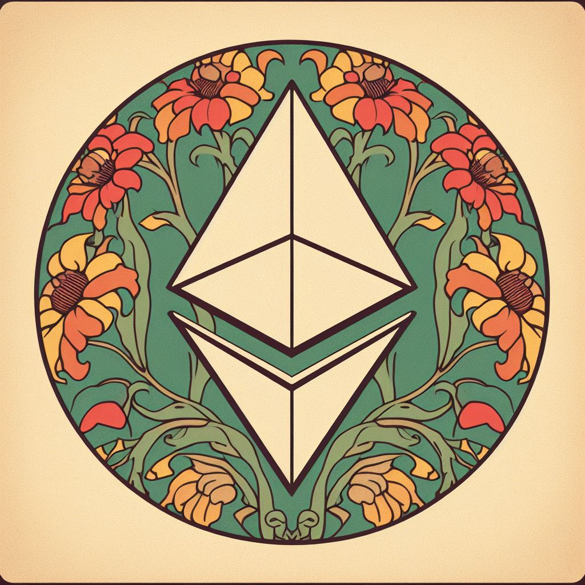

# ETHBohem1a (2024)

> The meta-hackathon focused on building self-hosted Ethereum events culture

- Date: **February-March 2024** (TBD)
- Duration: **3-7 days** (TBD)
- Location: **TBD, Czech Republic** 🇨🇿
- Organized by 👨‍🌾 [Ethereum Event Gardeners](https://ethevents.club/) & 🇨🇿 [Gwei.cz](https://gwei.cz/)

### Abstract

*ETHBohemia[^ETHBOHEMIA] is a hackathon aimed at innovating event planning and community engagement. We bring together organizers, developers, and creatives to create transformative solutions for events from planning to experience. The event will not host any sponsors or commercial talks.*

## Table of Content

1. [Hackathon](#1-hackathon)
   1. [Schedule](#11-schedule)
   2. [Contributors](#12-contributors)
   3. [Hacking and Rules](#13-hacking-and-rules)
   4. [Hack-streams](#14-hack-streams)
   5. [Stream and Recordings](#15-stream-and-recordings)
3. [Call For Participation](#2-call-for-participation)
4. [Venue](#3-venue)
5. [About the Host](#4-about-the-host)
   1. [Contact](#41-contact)

## 1. Hackathon

ETHBohemia[^ETHBOHEMIA] is envisioned as a dynamic, multi-day platform that brings together a diverse array of individuals, from event organizers and open-source tool developers to community advocates and creative visionaries — to focus on inclusivity, diversity, and innovation in event planning. We're not just exploring new tools for easier event organization; we're also diving into meaningful dialogues that uphold our non-profit values. The collaboration results in a wealth of shared insights that enrich both our community and the broader event landscape.

Our expansive lens extends beyond the realm of simple gatherings, encompassing the entire event lifecycle—from intimate meetups to large-scale conferences, and from online to offline hackathons. We delve into the nuances of event planning, execution, and follow-up with a keen eye for innovation. This includes exploring state-of-the-art solutions for event data structuring, Ethereum ecosystem cataloging, and the latest in ticketing, video streaming, and hackathon platforms. However, our explorations aren't limited to just the technical aspects; we also tackle the more complex issues such as financing models, self-regulation, and attendee privacy. The ultimate goal is to arrive at actionable, holistic solutions that meet the needs of both organizers and participants, thereby revolutionizing the way events are conceptualized, organized, and enjoyed.

We expect to host around 50 in-person participants, with additional options for online engagement. A strict adherence to our event's Code of Conduct ensures that ETHBohemia remains a respectful and transformative experience for all involved.

ETHBohemia is a donation-backed non-profit event. Therefore, there will be no sponsors.

[^ETHBOHEMIA]: ETHBohemia; Bohemia (/boʊˈhiːmiə/) is the westernmost and largest historical region of the Czech Republic. https://en.wikipedia.org/wiki/Bohemia

### 1.1 Schedule

TBA

### 1.2 Contributors

These are the participants who have pledged to attend (may change):

| Name | Organizing | Community/Project | Skills |
| --- | --- | --- | --- |
| **[Tree](https://warpcast.com/tree)** | 🇨🇿 [ETHBrno](https://ethbrno.cz/), 🌐 [W3PE](https://github.com/web3privacy/events)[^W3PE] | [Ethereum Event Gardeners](https://ethevents.club/), [Gwei.cz](https://gwei.cz/) | backend dev |
| **[PG](https://twitter.com/PG_CDG)** | 🇮🇹 [ETHRome](https://www.ethrome.org/), 🌐 [W3PE](https://github.com/web3privacy/events)[^W3PE] | [Web3Privacy Now](https://web3privacy.info/), [CryptoCanal](https://www.cryptocanal.org/) | |
| **[Wesley](https://twitter.com/wslyvh)** | 🌐 [Devconnect](https://devconnect.org/) | [Ethereum Foundation](https://ethereum.foundation/), [StreamETH](https://streameth.org/) | |
| **[Radek](https://twitter.com/radk)** | 🇨🇿 [BeerFi Prague](https://beerfi.gwei.cz/) | [Gwei.cz](https://gwei.cz/) | SC dev |
| **[Coinmandeer](https://twitter.com/KeenOfCoin)** | 🌐 [Web3Privacy Events](https://github.com/web3privacy/events)[^W3PE] | [Gwei.cz](https://gwei.cz/), [Web3Privacy Now](https://web3privacy.info/) | design |

[^W3PE]: Web3Privacy Events: events department of Web3Privacy Now community; https://web3privacy.info/

### 1.3 Hacking and Rules

This will be a completely different hackathon. We will decide and publish the projects to be hacked together in advance. Hackers goal will not be to fight each other for prizes or bounties, but instead to cooperate with each other. There will be no jury to judge your contribution - we will quantify this reputation together directly on a personal level using tools like [Coordinape](https://coordinape.com/).

### 1.4 Hack-streams

| Name           | Type               | Description                                       |
| ---            | ---                | ---                                               |
| EthereumEG     | Project            | Bootstrapping the initiative (primary)           |
| Event Lists    | Project            | Event data interchange format specification      |
| Chronicle (db) | Project            | Historical Database of ETH Events                |
| ethevents.xyz  | Project            | Frontend for Ethereum event database (chronicle)  |
| Ethereum.org Events | Project        | Implementing our database into Ethereum.org     |
| Hackathon Org Guide | Project        | Knowledge base with best practices on how to organize a hackathon |
| Ticketing Solutions | Research      | Current status of ticketing systems and ways to improve |
| Visitors privacy | Research          | Recommendations to increase visitors' privacy    |
| Video Streaming | Research          | Exploring options, a guide to a low-cost setup   |
| Financing Models | Research         | Investigating sustainable financing for non-profit events |
| Confeth        | Project            | Future conference/hackathon planning and managing tool |
| Kickback       | Project            | Higher event participation with attendee pledging |

### 1.5 Stream and Recordings

Streaming and recording of part of the talks will be provided.

## 2. Call for Participation

Space is very limited and we are primarily looking for global ETH* event organizers and developers of open-source event tools.

If you are interested in participating, please [contact us](mailto:ethbohemia@skiff.com).

## 3. Venue

TBD

## 4. About the Host

The Hackathon is jointly hosted by the [Gwei.cz](https://gwei.cz) collective, which unites local Czech-Slovak web3 supporters, and the [Ethereum Event Gardeners](https://ethevents.club) community, an initiative that seeks to connect organizers and improve the culture of our events.

### 4.1 Contact

To connect with Ethereum Event Gardeners community, join our forum:
- https://ethevents.club/

Or you can use direct email connection:
- ethbohemia@skiff.com
